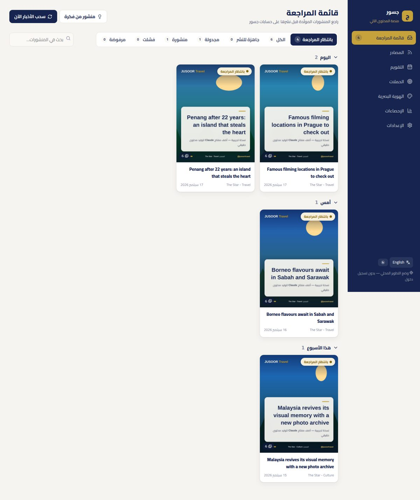
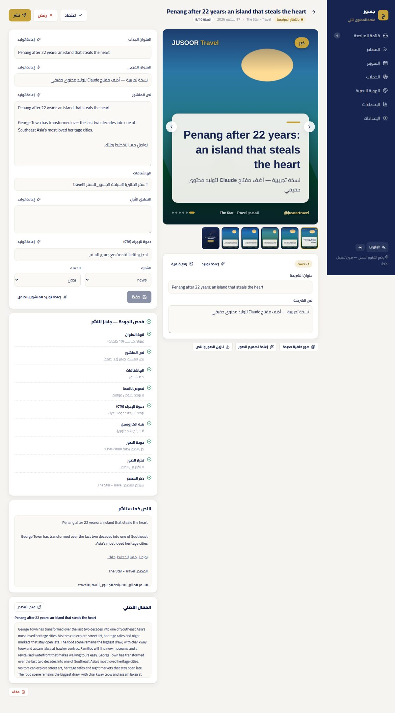

# جسور — النشر الذكي (Jusoor AutoPost)

نظام داخلي يحوّل أخبار السفر والثقافة إلى منشورات كاروسيل عربية بهوية **JUSOOR Travel**، ويمرّرها على مراجعة بشرية قبل نشرها على فيسبوك وإنستغرام (ومنصات أخرى) عبر **Buffer** أو **Meta Graph API** أو **upload-post.com**.



---

## ماذا يفعل؟

```
المصادر (مواقع / RSS)
      │  سحب تلقائي حسب الجدول
      ▼
مقالات جديدة ──► فلترة (مكرر / قديم / قصير)
      │
      ▼
Claude API ──► عنوان + نص + هاشتاقات + شرائح + CTA + درجة صلة
      │           (المقالات غير المناسبة لجمهور السفر تُرفض تلقائيًا)
      ▼
تصميم الشرائح 1080×1350 بهوية جسور (Chromium)
      │
      ▼
فحص الجودة ──► قائمة المراجعة ──► تعديل / اعتماد / رفض
      │
      ▼
نشر فوري أو مجدول ──► Buffer | Meta | upload-post
```

| القسم | الوظيفة |
|---|---|
| **قائمة المراجعة** | المسودات مجمّعة حسب اليوم، مع تبويبات للحالات وبحث |
| **محرر المنشور** | معاينة الشرائح وتعديل كل نص، وإعادة توليد أي جزء، ورفع خلفية مخصصة، وفحص الجودة، والنشر أو الجدولة، وتنزيل الصور والنص |
| **المصادر** | إضافة المواقع وخلاصات RSS، واختبار المصدر قبل حفظه، والسحب اليدوي، وحالة كل مصدر، والمقالات المسحوبة |
| **التقويم** | تخطيط المواضيع حسب الأيام، وتوليد منشور من أي موضوع، وعرض المنشورات المجدولة والمنشورة |
| **الحملات** | تجميع المنشورات تحت هدف تسويقي، مع إحصاءات لكل حملة |
| **الهوية البصرية** | عدة علامات تجارية، ولكل علامة ألوانها وشعارها وصوتها وقنوات نشرها، مع معاينة حيّة |
| **الإحصاءات** | المقالات المسحوبة، والمنشورات حسب الحالة والمصدر، ونتائج النشر لكل منصة |
| **الإعدادات** | اللغة والنبرة والجمهور وحد الصلة ومصدر الصور، والجدولة، والنشر، وحالة الاتصال بكل خدمة |

### تحسينات على الموقع الأصلي

- **فلتر الصلة:** Claude يقيّم كل مقال من 10، والمقالات البعيدة عن السفر (مثل الأخبار الأدبية) تُرفض تلقائيًا ويظهر سبب الرفض.
- **ذكر المصدر تلقائيًا** في نص المنشور وعلى الصور.
- **صور خالية من مشاكل الحقوق:** خيار استخدام صور Pexels المجانية بدل صور الموقع الأصلي.
- **فحص الجودة يمنع النشر** عند وجود نص مؤقت مثل «لا يوجد فيديو»، أو أكثر من 30 هاشتاق، أو صور ناقصة.
- **ثلاثة طرق للنشر** مع سجل مفصّل لكل منصة، والنشر الجزئي يظهر بوضوح.
- **عدة علامات تجارية** في نفس اللوحة (Jusoor Travel وJusoor Global وAssala).
- **واجهة عربية وإنجليزية**، مع وضع ليلي، وتعمل على الجوال.




---

## التقنيات

| الجزء | التقنية |
|---|---|
| لوحة التحكم | React 18 + Vite، وخط Cairo، وأيقونات Lucide، وCSS خاص بهوية جسور (بدون Bootstrap) |
| الخادم | Python 3.11 + FastAPI + SQLAlchemy + APScheduler |
| قاعدة البيانات وتسجيل الدخول وتخزين الصور | Supabase (PostgreSQL وAuth وStorage) |
| الذكاء الاصطناعي | **Claude API** (مخرجات منظّمة عبر tool use) أو أي خادم متوافق مع OpenAI مثل **AnythingLLM** |
| سحب الأخبار | httpx + BeautifulSoup + trafilatura + feedparser |
| تصميم الشرائح | HTML → JPEG عبر Chromium (Playwright)، لضمان تشكيل عربي صحيح |
| النشر | Buffer GraphQL API، وMeta Graph API، وupload-post.com API |
| الاستضافة المقترحة | الواجهة على **Vercel**، والخادم على **Railway** (Docker) |

```
jusoor-autopost/
├── backend/
│   ├── app/
│   │   ├── main.py              # نقطة التشغيل
│   │   ├── config.py            # متغيرات البيئة
│   │   ├── db.py                # الجداول
│   │   ├── auth.py              # التحقق من جلسة Supabase + قائمة البريد المسموح
│   │   ├── routes/              # drafts, sources, planning, brands, system
│   │   ├── services/            # scraper, generator, renderer, qa, pipeline, publishing, jobs
│   │   ├── publishers/          # buffer, meta, uploadpost
│   │   └── render/              # قالب الشريحة + خط Cairo
│   ├── scripts/seed_demo.py     # بيانات تجريبية
│   ├── tests/                   # 18 اختبارًا
│   ├── Dockerfile
│   └── railway.json
├── frontend/
│   ├── src/{pages,components,lib,styles}
│   └── vercel.json
├── supabase/schema.sql
└── docs/screenshots/
```

---

## التشغيل على جهازك (5 دقائق)

المتطلبات: Python 3.11 أو أحدث، وNode 20 أو أحدث.

```bash
# 1) الخادم
cd backend
python -m venv .venv && source .venv/bin/activate   # على Windows: .venv\Scripts\activate
pip install -r requirements.txt
playwright install chromium
cp .env.development.example .env        # ثم ضع ANTHROPIC_API_KEY
python -m scripts.seed_demo              # اختياري: بيانات تجريبية
uvicorn app.main:app --reload --port 8000

# 2) الواجهة (في نافذة أخرى)
cd frontend
npm install
npm run dev                              # http://localhost:5173
```

- **بدون أي مفتاح ذكاء اصطناعي** يعمل النظام بنصوص تجريبية حتى تتأكد من كل شيء.
- **على جهازك** الصور محفوظة محليًا، لذلك يعمل كل شيء ما عدا النشر الفعلي، لأن Meta وBuffer يحتاجان روابط صور عامة.
- **توثيق الـ API** متاح على `http://localhost:8000/api/docs`.

---

## النشر على الإنترنت

### 1) Supabase

1. أنشئ مشروعًا جديدًا (المنطقة المقترحة: Singapore).
2. افتح **SQL Editor** وشغّل الملف `supabase/schema.sql`. سينشئ الجداول ويفعّل RLS، وينشئ حاوية الصور العامة `autopost-media`.
3. من **Authentication → Users → Add user** أنشئ حسابك (بريد وكلمة مرور)، ثم عطّل التسجيل العام من **Authentication → Sign In / Providers**.
4. احتفظ بهذه القيم:
   - `Project URL`
   - مفتاح `anon`
   - مفتاح `service_role` (سري، للخادم فقط)
   - رابط قاعدة البيانات من **Connect → Session pooler**

### 2) الخادم على Railway

1. **New Project → Deploy from GitHub** واختر مجلد `backend`. سيبني Railway الملف `Dockerfile` تلقائيًا.
2. أضف المتغيرات من `backend/.env.example`، وأهمها:

| المتغير | القيمة |
|---|---|
| `DATABASE_URL` | رابط Session pooler (المنفذ 5432) |
| `SUPABASE_URL` / `SUPABASE_ANON_KEY` / `SUPABASE_SERVICE_ROLE_KEY` | من Supabase |
| `ALLOWED_EMAILS` | بريدك (ومن تريد إضافته) |
| `STORAGE_BACKEND` | `supabase` |
| `CORS_ORIGINS` | رابط الواجهة على Vercel |
| `AI_PROVIDER` | `anthropic` أو `openai_compatible` |
| `ANTHROPIC_API_KEY` | من console.anthropic.com (عند اختيار anthropic) |
| `AI_BASE_URL` / `AI_API_KEY` / `AI_MODEL` | عند اختيار AnythingLLM أو أي خادم متوافق مع OpenAI |
| `PEXELS_API_KEY` | من pexels.com/api (مجاني) |
| `BUFFER_API_KEY` / `META_ACCESS_TOKEN` / `UPLOADPOST_API_KEY` | حسب ما تستخدمه |

3. اترك عدد النسخ **1**. المجدول الداخلي يعمل داخل الخادم، وتعدد النسخ يكرر السحب والنشر.

### 3) الواجهة على Vercel

1. **New Project** واختر مجلد `frontend` (Framework: Vite).
2. أضف المتغيرات:
   - `VITE_API_URL`: رابط الخادم على Railway
   - `VITE_SUPABASE_URL`
   - `VITE_SUPABASE_ANON_KEY`
3. يمكنك ربط نطاق فرعي مثل `autopost.jusoortravel.com`، ثم إضافته إلى `CORS_ORIGINS` في Railway.

---

## اختيار محرّك الذكاء الاصطناعي (Claude أو AnythingLLM)

النظام يعمل على محرّكين، ويُبدَّل بينهما من ملف البيئة فقط دون تغيير الكود.

### (أ) Claude API — الخيار الافتراضي

```env
AI_PROVIDER=anthropic
ANTHROPIC_API_KEY=sk-ant-...
ANTHROPIC_MODEL=claude-sonnet-5
```

يستخدم **tool use**، أي أن المخرجات تعود بصيغة JSON منظّمة مضمونة (عنوان، نص، هاشتاقات، شرائح، درجة صلة).

### (ب) AnythingLLM أو أي خادم متوافق مع OpenAI

```env
AI_PROVIDER=openai_compatible
AI_BASE_URL=https://llm.yourdomain.com/api/v1/openai
AI_API_KEY=<مفتاح AnythingLLM>
AI_MODEL=<اسم مساحة العمل / workspace slug>
AI_JSON_MODE=true
```

النظام يرسل الطلب إلى `POST {AI_BASE_URL}/chat/completions` بترويسة `Authorization: Bearer`، وينطبق نفس الإعداد على **Ollama** و**LM Studio** و**vLLM** وأي خادم يتبع واجهة OpenAI.

**كيف يتعامل النظام مع غياب tool use؟** هذه الخوادم لا تدعم استدعاء الأدوات، لذلك يضع النظام مخطط JSON داخل الطلب نفسه، ثم يعالج الرد بتسامح:

- يزيل علامات الأكواد (```json) وأي كلام قبل أو بعد الـ JSON.
- إذا لم يكن الرد JSON صالحًا، يعيد السؤال حتى ثلاث محاولات مع إخبار النموذج بخطئه.
- إذا رفض الخادم خاصية `response_format` يعيد المحاولة تلقائيًا بدونها.
- يصحّح الأشكال الشائعة: هاشتاقات في سطر واحد، شرائح كنصوص بلا عناوين، درجة صلة كنص.
- إذا نقص حقل أساسي (العنوان أو النص أو الشرائح) تُسجَّل المسودة كـ **فشلت** مع بيان السبب، ولا يُنشر شيء ناقص.

**أمور تستحق الانتباه:**

| النقطة | التفصيل |
|---|---|
| جودة النتيجة | AnythingLLM ليس نموذجًا، بل واجهة لنموذج آخر. النتيجة تتبع النموذج خلفه: النماذج الكبيرة قريبة من Claude، والنماذج المحلية الصغيرة (7B مثلًا) تضعف عربيتها وتخطئ في بنية JSON |
| ميزة إضافية | إذا كانت مساحة العمل تضم مستندات جسور (دليل العلامة، الوجهات، الأسعار) فسيكتب النموذج معتمدًا عليها |
| الخصوصية | مع نموذج محلي لا يغادر أي نص خوادمك |
| الاستضافة | يجب أن يكون خادم AnythingLLM قابلًا للوصول من Railway، وإلا فشغّل الخادم في نفس الشبكة |

**اختبار سريع بعد الضبط:** افتح **الإعدادات ← حالة النظام**، وستجد المحرّك المستخدم واسم النموذج والرابط. ثم جرّب **منشور من فكرة** من قائمة المراجعة؛ إن ظهر منشور كامل فالربط سليم.

---

## ربط منصات النشر

### Buffer (الأسهل)

1. من إعدادات حسابك في Buffer أنشئ **API key** وضعه في `BUFFER_API_KEY`.
2. في اللوحة افتح **الهوية البصرية ← قنوات النشر ← تحميل القنوات**، واختر صفحة فيسبوك وحساب إنستغرام، ثم احفظ.
3. من **الإعدادات** اختر طريقة Buffer:
   - **نشر فوري**
   - **إضافة لطابور Buffer**، فيُنشر المنشور حسب أوقات الطابور في Buffer

### Meta Graph API (مجاني)

1. من developers.facebook.com أنشئ تطبيقًا من نوع **Business**.
2. أضف إليه منتجَي **Facebook Login for Business** و**Instagram**.
3. الصلاحيات المطلوبة:
   - `pages_show_list`
   - `pages_read_engagement`
   - `pages_manage_posts`
   - `instagram_basic`
   - `instagram_content_publish`
   - `business_management`
4. من **Business Settings → System users** أنشئ مستخدم نظام، واربطه بالصفحة وحساب إنستغرام، ثم أنشئ رمزًا دائمًا وضعه في `META_ACCESS_TOKEN`.
5. في **الهوية البصرية** أدخل:
   - **Facebook Page ID**
   - **Instagram User ID** (معرّف حساب إنستغرام المهني المرتبط بالصفحة)
6. حدود إنستغرام:
   - 100 منشور عبر الـ API كل 24 ساعة
   - 10 شرائح كحد أقصى
   - صيغة JPEG فقط، والنظام يلتزم بذلك تلقائيًا

### upload-post.com

1. أنشئ **API key** وضعه في `UPLOADPOST_API_KEY`.
2. اربط حساباتك داخل upload-post تحت **Profile** (اسم مستخدم).
3. في **الهوية البصرية** أدخل:
   - **اسم المستخدم**
   - **Facebook Page ID** (مطلوب للنشر على فيسبوك)

يدعم أيضًا لينكدإن وتيك توك وX وثريدز وبينتريست.

---

## إضافة مصادر جديدة

- **RSS:** ضع رابط الخلاصة فقط.
- **موقع:** ضع رابط صفحة الأقسام (مثل صفحة Travel). النظام يكتشف روابط المقالات تلقائيًا.
  - للدقة الأعلى أضف **نمط الروابط**، مثلًا `/lifestyle/travel/\d{4}/`.
  - أو أضف **محدد CSS** للروابط.
- **اختبر قبل الحفظ:** زر **اختبار** يعرض الروابط المكتشفة وعيّنة من المقالات قبل أن تحفظ المصدر.

---

## عند وجود مشكلة في الدخول

افتح في المتصفح: `https://<رابط-الخادم>/api/health`

الصفحة تعرض حالة كل إعداد وتسمّي الخطأ في قائمة `problems`، ولا تكشف أي مفتاح. أمثلة:

| ما تراه | المعنى |
|---|---|
| `"anon_key": "secret_key_wrong"` | وضعت المفتاح السري بدل مفتاح anon في `SUPABASE_ANON_KEY` |
| `"anon_key": "missing"` | المتغير غير موجود في الخادم |
| `"supabase_check": {"ok": false, ...}` | الرابط والمفتاح لا يخصان نفس المشروع |
| `"supabase_url"` ينتهي بمسار | الرابط يجب أن ينتهي عند `.supabase.co` (النظام يصحّحه تلقائيًا لكن الأفضل تصحيحه) |
| `"public": false` في storage | الصور غير متاحة للعامة، والنشر سيفشل |

وعند رفض الجلسة تظهر الرسالة في صفحة الدخول نفسها بدل الخروج الصامت.

## الأمان

- **الدخول:** بحساب Supabase، والخادم يتحقق من كل طلب ويقبل فقط البريد الموجود في `ALLOWED_EMAILS`.
- **المفاتيح:** كلها على الخادم فقط، ولا يصل أي مفتاح إلى المتصفح.
- **الجداول:** RLS مفعّل عليها، فلا يستطيع مفتاح `anon` قراءتها.
- **الملفات المرفوعة:** يُتحقق من نوعها وحجمها (الصور حتى 10 ميغابايت، والشعار حتى 3 ميغابايت).
- **صفحة التوثيق** `/api/docs` تُغلق تلقائيًا عند `ENVIRONMENT=production`.
- **الواجهة:** لا تفهرسها محركات البحث (`noindex`).

## الاختبارات

```bash
cd backend && pytest -q                  # SQLite
TEST_DATABASE_URL=postgresql://... pytest -q   # PostgreSQL
```

تغطي الاختبارات:

- سحب الأخبار واكتشاف الروابط وحذف المكرر
- خط الإنتاج كاملًا حتى الصور 1080×1350
- فحص الجودة
- الجدولة والنشر الجزئي
- التقويم والحملات
- طلبات Buffer وMeta وupload-post (ببيانات وهمية)
- محرّكي الذكاء الاصطناعي: tool use في Claude، وتحليل ردود AnythingLLM بما فيها JSON داخل علامات أكواد، وإعادة المحاولة عند رد غير صالح، ورفض الحقول الناقصة

## ملاحظة عن حقوق المحتوى

النظام يعيد صياغة المقالات ولا يترجمها حرفيًا، ويذكر المصدر افتراضيًا. مع ذلك:

- راجع شروط استخدام كل موقع قبل الاعتماد عليه.
- فضّل خيار **صور Pexels** بدل صور المواقع الأصلية.
- لا تنشر بدون مراجعة، خاصة الأخبار التي فيها أرقام أو أسعار.
